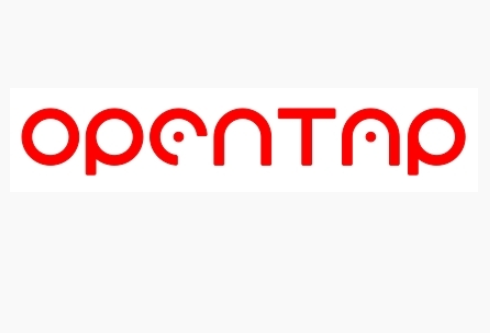

## Overview
Welcome to the Keysight *interbotix_ros_turrets* repository! This repo contains custom ROS packages to control the wxxms turret (a.k.a pan/tilt mechanisms) sold at [Interbotix](https://www.trossenrobotics.com/) using [Keysight PathWave Test Automation](https://www.keysight.com/us/en/products/software/pathwave-test-software/pathwave-test-automation-software.html) built on [OpenTAP](https://opentap.io/). These ROS packages build upon the ROS driver nodes found in the [interbotix_ros_core](https://github.com/Interbotix/interbotix_ros_core) repository. Support-level software can be found in the [interbotix_ros_toolboxes](https://github.com/Interbotix/interbotix_ros_toolboxes) repository.

## OpenTAP

OpenTAP is an open source project for fast and easy development, deployment and execution of automated tests.

The goal of OpenTAP is to transform test automation from a largely homegrown, isolated endeavor into a standardized activity that speeds test development and adds innovative capabilities. OpenTAP leverages open source collaboration as a proven strategy to create broadly interoperable and reusable technology.

The OpenTAP mission is to provide a test automation solution built on simplicity, scalability, and speed to make test automation easier and more accessible for all.

We love to experiment and innovate. We invite you to do the same. Working together, we will inspire and teach one another better ways to automate. Join our community.

[OpenTAP Forums](https://forum.opentap.io/)

## Keysight PathWave Test Automation Compatibility

This version of interbotix_ros_turrets was specifically made to allow for control of the wxxms turret on any Windows 10 computer using the OpenTAP.Plugins.HornPositioner plugin developed by Aaron Wood at Keysight Technologies using Keysight PathWave Test Automation. All other uses are not currently supported. 

Click [here](https://www.keysight.com/us/en/products/software/pathwave-test-software/pathwave-test-automation-software.html) to find out about Keysight PathWave Test Automation and other Keysight software products availible for purchase

## Contributing
Feel free to use, modify, or update any part of this repo for allowing control of the ROS Turret using any software tool availible.

## Contributors
- [Solomon Wiznitzer](https://github.com/swiz23) - **ROS Engineer**
- [Levi Todes](https://github.com/LeTo37) - **CAD Engineer**
- Aaron Wood (aaron.wood@keysight.com) - **Keysight OpenTAP Software Engineer**
